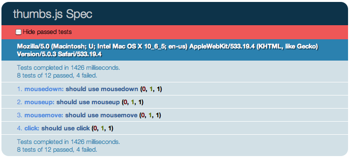

QUnit Results Header
====================

Duplicates the _Tests Completed_ summary at the top of your QUnit test suite.

Install
-------

1. Copy `qunit/qunit.header.js`
2. Copy `qunit/qunit.header.css`
3. Add the following code to your markup:

        <!-- After qunit.css -->
        <link rel="stylesheet" type="text/css" media="screen" href="qunit.header.css" />
        
        <!-- After qunit.js -->
        
